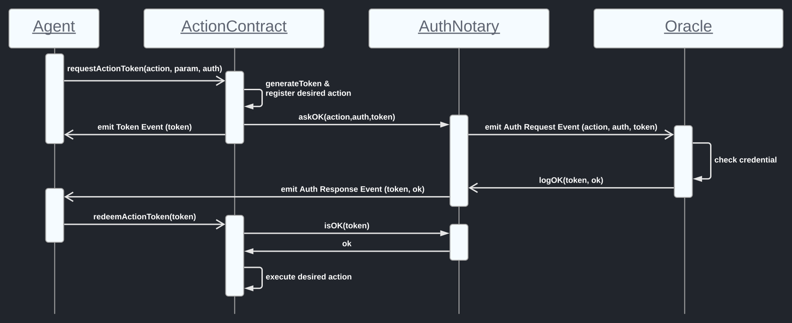

# Action Token Oracle Pattern

_Technologies:_
Ethereum (Smart Contracts) + off-chain authorization systems (e.g. Solid, Hyperledger Indy/Aries, ...)

## Question: 
How do you check if a caller on your Smart Contract function is authorized to do so?

## Naive answer: 
Just write a whiteliste with authorized ethereum addresses.

## Problem: 
How is this whitelist curated? 
The responsible party must keep it updated, whenever _some_ authorization expires, gets revoked, is yielded, ... ?

Unless all of your solution is in one single chain, you have the problem of blockchain interoperability with the off-chain world.
A common setup for authorization manages rights via [Verifiable Credentials (VC)](https://www.w3.org/TR/vc-data-model/), e.g. in [Solid](https://solidproject.org) or in Hyperledger Indy/Aries.

## Goal:
Use VCs to authorize an agent to invoke functions of a Smart Contract.

## Solution Approach: The Action Token Oracle Pattern.

The idea is simple: When an agent invokes a secured function, the agent has to transmit the corresponding credential to the Smart Contract.
Only when the credential is verified and accepted by the Smart Contract, the desired action is executed.

However, it is best practise to not store credentials on-chain. In Indy/Aries for example, credentials are stored locally in an agents wallet.
When transmitting a credential for a function to be executed, the credential gets logged to the chain as a submitted parameter.
Hence, we do not transmit the VC itself, but only an identifier of that credential in form of a URI.
(Of course, you can modify the identification of a credential as needed for your use-case.)
In our Setup, VCs are stored on Solid Pods, a semantically-enriched web server with access control. 

Smart Contracts interact with the off-chain world relying on [Oracles](https://ethereum.org/en/developers/docs/oracles/).
Oracles live off-chain and provide data from the off-chain world to the Smart Contract and vice versa.
The oracle has the task to check if the agent invoking the function is in-fact authorized to do so.
To this end, the oracle verifies the validity of the VC.
In our setup, it can dereference the URI submitted upon function invocation to receive the VC.
(Of course, you can modify discovery and exchange of the identified credential as needed for your use-case.)
After verification, the oracle responds to the Smart Contract with the result, thereby allowing the desired action to be executed.
(Of course, you can modify the setup of the oracle(s) and their reputation, voting, etc. as needed for your use-case.)

_Note:_ The `AuthOracle.sol` is not an Oracle. It is a Smart Contract to interact with Oracles which live off-chain.

The Action Token Oracle Pattern has four components:
- the __Agent__ that wants to execute a Smart Contract function.
- the __ActionContract__, i.e. the Smart Contract where the function is implemented.
- the __AuthOracle__ contract, i.e. the Smart Contract that interacts with Oracles.
- the __Oracle(s)__ that verify authorization, i.e. credentials, off-chain.

The basic idea of this pattern is the following, illustrated in Figure 1:

Figure 1: Sequence diagram of the action token oracle pattern.

An __agent__ needs to be authorized to execute specific functions of the __ActionContract__.
Such secured functions are internal, i.e. they can be only invoked by the Smart Contract itself.
To execute such function, the __agent__ needs to request an `action token` from the __ActionContract__ by submitting the `action` (in our case identified using a URI), the `parameter` and the `authorization` info (in our case the vc identified using a URI).

The Action contract registers the action and its parameters and provides a token that is associated to that particular desired action, i.e. action + parameters.
This token is then passed back to the __agent__, and, more importantly, passed to the __AuthOracle__ contract for verification.

The __AuthOracle__ emits an event asking the off-chain __Oracle(s)__ to verifiy that the agent is in-fact authorized to execute the desired action.

The __Oracle(s)__ receive and dereference the credential URI.
The validity of the credential is verified and the approval of the token is responded back to the __AuthOracle__ contract which emits a corresponding event.
The __agent__ is notified by this event that the token is ready for redemtion (if the verification was successfull).

Now, the __agent__ can simply redeem the `action token` at the __ActionContract__.
Of course, the __ActionContract__ checks back with the __AuthOracle__ contract if the token has really been approved by the __Oracle(s)__.
If so, proceed.
Since the __ActionContract__ has pre-registered all necessary information, the token suffices to execute the desired action with the pre-defined parameters.

## Check it out!
Use [Remix](https://remix.ethereum.org/) to test out the Smart Contracts.
Of course, the off-chain part has to be done manually.

## Compilation and Deployment

Either you do it manually or you use the [web3py-contractor](https://github.com/uvdsl/web3py-contractor) for compilation and deployment!